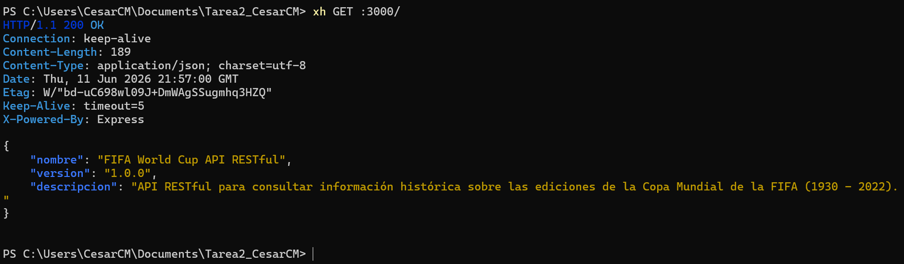
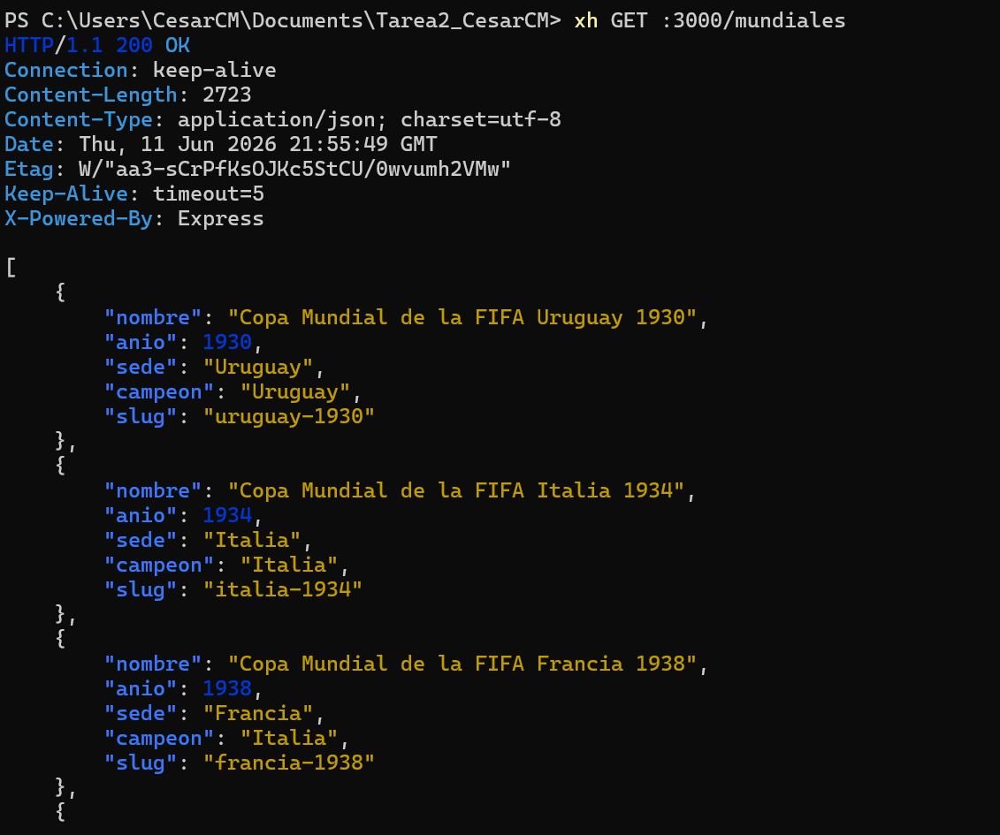
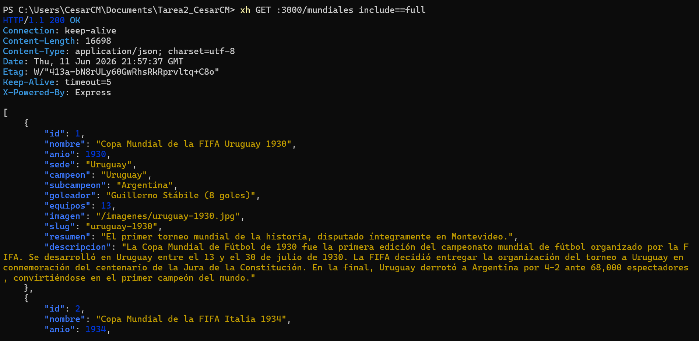
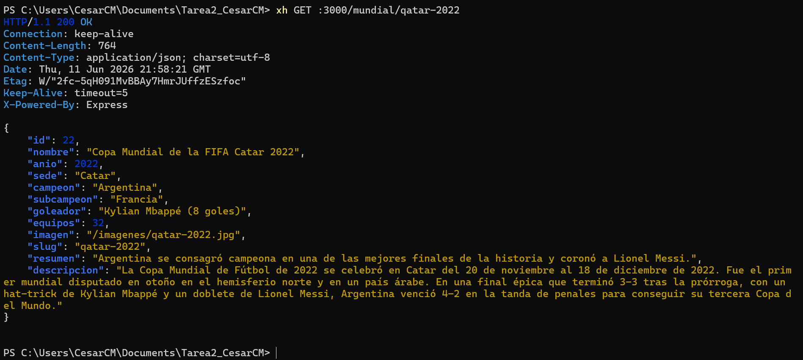
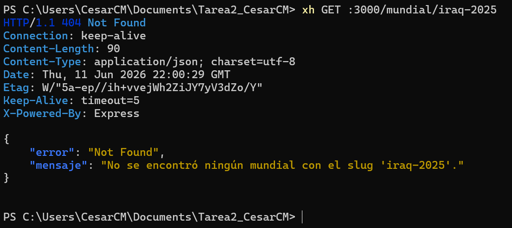
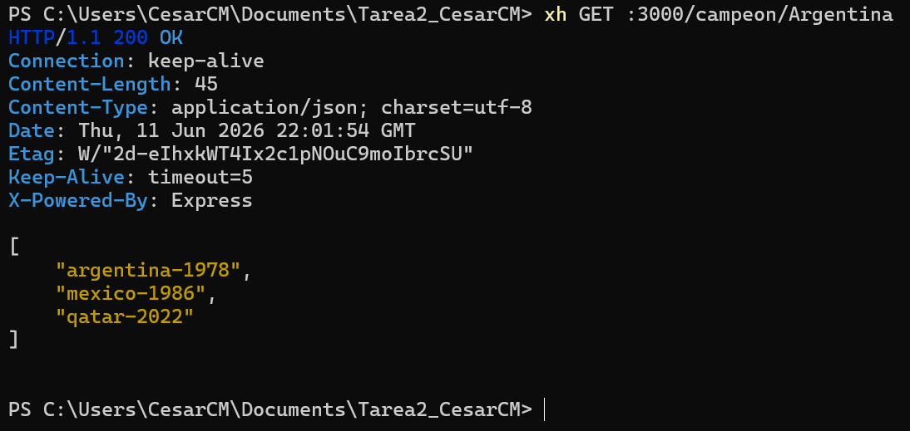
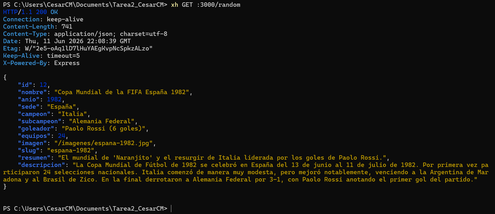
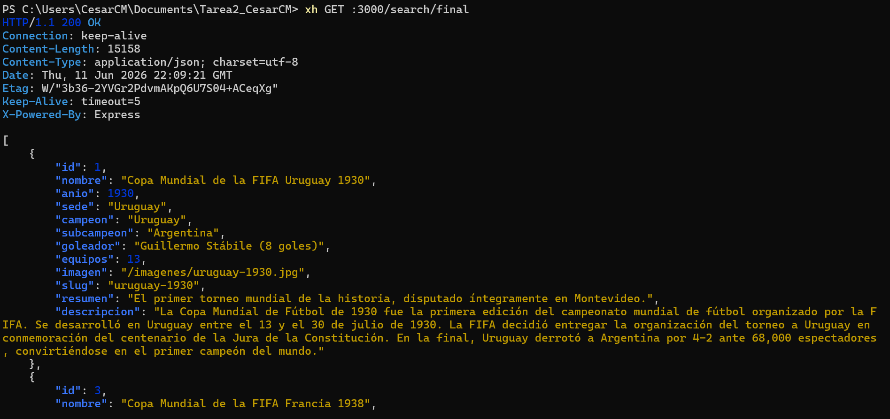
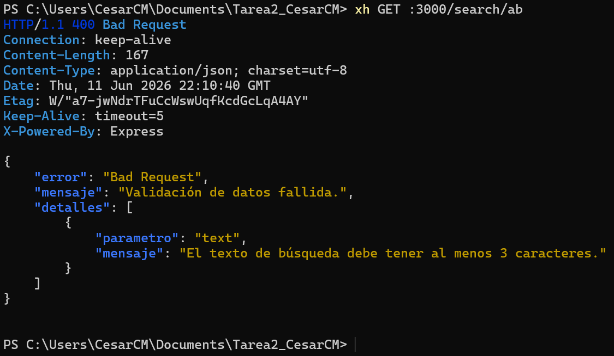

# FIFA World Cup RESTful API

Esta es una API RESTful diseñada para consultar información histórica detallada de las 22 ediciones de la Copa Mundial de la FIFA (desde Uruguay 1930 hasta Catar 2022). Está construida sobre **Node.js** utilizando **Express**, con persistencia local en **SQLite** (mediante `better-sqlite3`) y validación robusta de datos con **Zod**.

---

## Capturas de pantalla de las pruebas solicitadas

- **GET / (Inicio):**
  

- **GET /mundiales:**
  

- **GET /mundiales?include=full:**
  

- **GET /mundial/qatar-2022:**
  

- **GET /mundial/inexistente:**
  

- **GET /campeon/Argentina:**
  

- **GET /random:**
  

- **GET /search/Final:**
  

- **GET /search/ab (Fallo de validación Zod):**
  

## Tecnologías y Características
- **Backend:** Node.js, Express (v5)
- **Base de Datos:** SQLite (`better-sqlite3` para sincronización y velocidad)
- **Validación:** Zod (para parámetros y búsquedas)
- **Archivos Estáticos:** Servido local de imágenes de mundiales.
- **Resiliencia:** Manejo global de errores (try/catch, middlewares de 404 y 500) para evitar la caída del servidor.

---

## Instalación y Configuración

Sigue estos pasos para poner en marcha el proyecto localmente:

### 1. Clonar o descargar el proyecto
Asegúrate de estar ubicado en la raíz del proyecto.

### 2. Instalar dependencias
Instala los paquetes necesarios definidos en el `package.json`:
```bash
npm install
```

### 3. Inicializar y Sembrar la Base de Datos
Para crear la base de datos SQLite (`copa_mundial.db`) y poblarla automáticamente con la información histórica de las 22 ediciones de los mundiales recuperadas del sitio RSSSF (Fundación de Estadísticas de Fútbol Rec.), ejecuta:
```bash
npm run seed
```
*Verás la salida en consola de las sentencias `INSERT` ejecutándose de forma transaccional.*

### 4. Iniciar el Servidor
Puedes arrancar la aplicación de dos formas:

- **Modo Producción:**
  ```bash
  npm start
  ```
- **Modo Desarrollo (con recarga automática mediante Nodemon):**
  ```bash
  npm run dev
  ```
El servidor se iniciará por defecto en el puerto **3000** (URL base: `http://localhost:3000`).

---

## 📂 Estructura del Proyecto

```text
Tarea2_CesarCM/
├── database/
│   ├── connection.js       # Conexión principal de SQLite con better-sqlite3
│   └── init.js             # Script de inicialización de la tabla y siembra de datos
├── public/
│   └── imagenes/           # Directorio para imágenes y recursos estáticos
├── src/
│   ├── controllers/
│   │   └── mundial.controller.js # Controladores de lógica de endpoints
│   ├── middleware/
│   │   └── error.middleware.js   # Manejadores de errores (Zod 400, 404, 500)
│   ├── routes/
│   │   └── mundial.routes.js     # Enrutamiento de la aplicación
│   ├── schemas/
│   │   └── mundial.schema.js     # Esquema Zod de validación de búsquedas
│   └── app.js              # Configuración e inicialización de Express
├── index.js                # Punto de entrada de la aplicación
├── package.json            # Gestión de dependencias y scripts
└── README.md               # Este archivo de documentación
```

---

## Rutas del API e Información de Endpoints

### 1. Información General de la API
Retorna los metadatos generales de la API.
- **Ruta:** `GET /`
- **Respuesta Exitosa (200 OK):**
  ```json
  {
    "nombre": "FIFA World Cup API RESTful",
    "version": "1.0.0",
    "descripcion": "API RESTful para consultar información histórica sobre las ediciones de la Copa Mundial de la FIFA (1930 - 2022)."
  }
  ```

---

### 2. Listar Mundiales (Datos Básicos o Completos)
Retorna la lista de todas las ediciones del mundial. Por defecto, solo retorna campos esenciales (`nombre`, `anio`, `sede`, `campeon`, `slug`).
- **Ruta:** `GET /mundiales`
- **Parámetros de consulta (Query params) opcionales:**
  - `?include=full`: Si se añade este parámetro, retorna todos los campos de cada mundial de la base de datos.
- **Ejemplo de Respuesta básica (200 OK):**
  ```json
  [
    {
      "nombre": "Copa Mundial de la FIFA Uruguay 1930",
      "anio": 1930,
      "sede": "Uruguay",
      "campeon": "Uruguay",
      "slug": "uruguay-1930"
    },
    ...
  ]
  ```

---

### 3. Obtener un Mundial Específico por su Slug
Devuelve todos los detalles de un mundial en particular buscando a través de su identificador único (`slug`).
- **Ruta:** `GET /mundial/:slug`
- **Ejemplo:** `GET /mundial/qatar-2022`
- **Respuesta Exitosa (200 OK):**
  ```json
  {
    "id": 22,
    "nombre": "Copa Mundial de la FIFA Catar 2022",
    "anio": 2022,
    "sede": "Catar",
    "campeon": "Argentina",
    "subcampeon": "Francia",
    "goleador": "Kylian Mbappé (8 goles)",
    "equipos": 32,
    "imagen": "/imagenes/qatar-2022.jpg",
    "slug": "qatar-2022",
    "resumen": "Argentina se consagró campeona en una de las mejores finales de la historia y coronó a Lionel Messi.",
    "descripcion": "La Copa Mundial de Fútbol de 2022 se celebró en Catar del 20 de noviembre al 18 de diciembre de 2022..."
  }
  ```
- **Error (404 Not Found):** Si el mundial no existe.
  ```json
  {
    "error": "Not Found",
    "mensaje": "No se encontró ningún mundial con el slug 'mundial-inexistente'."
  }
  ```

---

### 4. Buscar Mundiales Ganados por un País
Retorna un array de strings conteniendo los slugs de las ediciones ganadas por el país indicado. La búsqueda es insensible a mayúsculas y minúsculas.
- **Ruta:** `GET /campeon/:pais`
- **Ejemplo:** `GET /campeon/argentina`
- **Respuesta Exitosa (200 OK):**
  ```json
  [
    "argentina-1978",
    "mexico-1986",
    "qatar-2022"
  ]
  ```

---

### 5. Obtener una Edición Aleatoria
Retorna todos los detalles de un mundial de fútbol seleccionado de manera aleatoria.
- **Ruta:** `GET /random`
- **Respuesta Exitosa (200 OK):** Retorna la información completa de una edición al azar (ej. Italia 1990, Suecia 1958, etc.).

---

### 6. Búsqueda por Texto
Busca coincidencias parciales de texto dentro de los campos `nombre`, `resumen` o `descripcion`.
- **Ruta:** `GET /search/:text`
- **Ejemplo:** `GET /search/Maradona`
- **Validación:** Se utiliza Zod para verificar que el parámetro `:text` contenga al menos **3 caracteres**.
- **Respuesta Exitosa (200 OK):** Array con los mundiales que contienen el texto.
- **Error de Validación (400 Bad Request):** Si el texto ingresado tiene menos de 3 caracteres.
  ```json
  {
    "error": "Bad Request",
    "mensaje": "Validación de datos fallida.",
    "detalles": [
      {
        "parametro": "text",
        "mensaje": "El texto de búsqueda debe tener al menos 3 caracteres."
      }
    ]
  }
  ```

---

### 7. Servicio de Archivos Estáticos (Imágenes)
Las imágenes de las copas mundiales están disponibles de forma estática en la ruta `/imagenes/*.jpg` (o `.png`).
- **Ejemplo de acceso:** `http://localhost:3000/imagenes/test.png`

---

## Control de Errores Genéricos

Si se intenta acceder a una ruta inexistente, la API responderá siempre en formato JSON:
- **Ejemplo:** `GET /ruta/inexistente`
- **Respuesta (404 Not Found):**
  ```json
  {
    "error": "Not Found",
    "mensaje": "La ruta solicitada '/ruta/inexistente' no existe en este servidor."
  }
  ```


